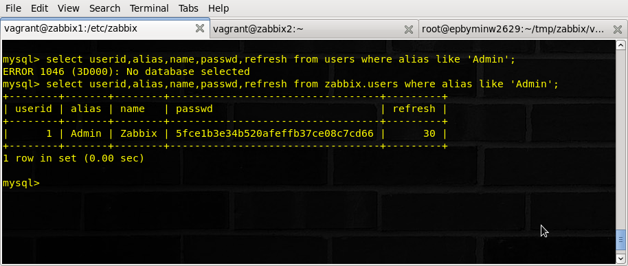
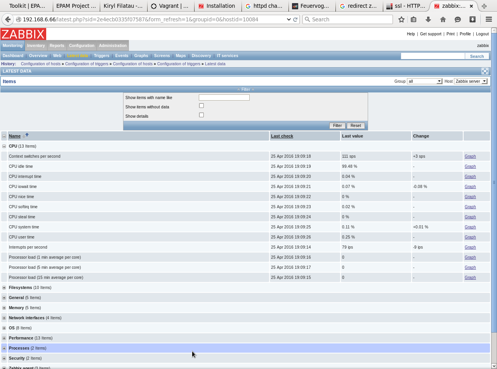
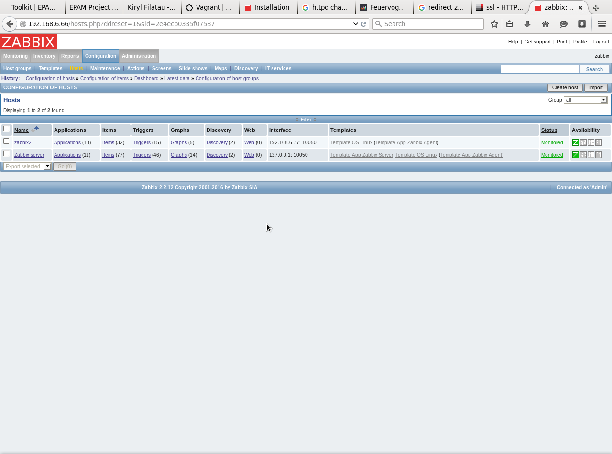
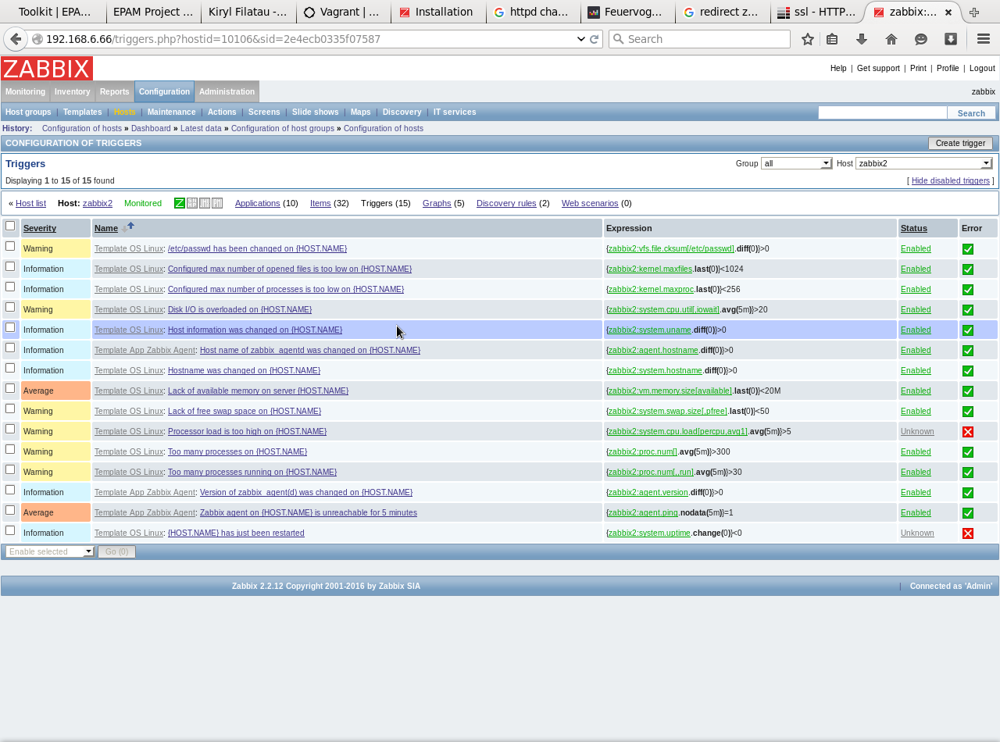
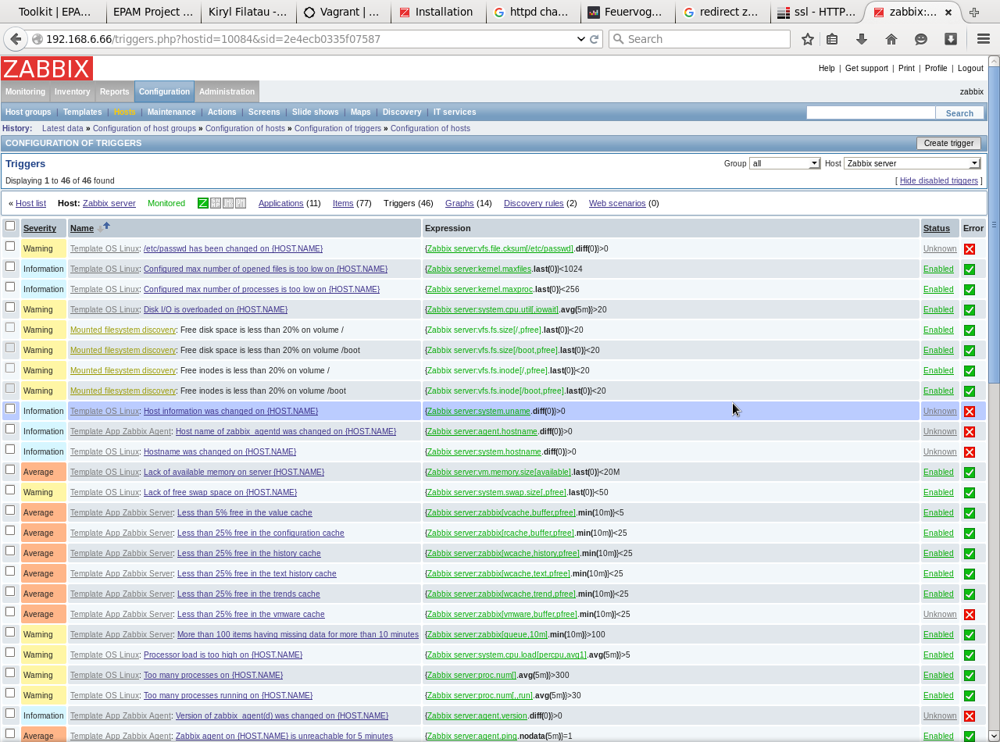
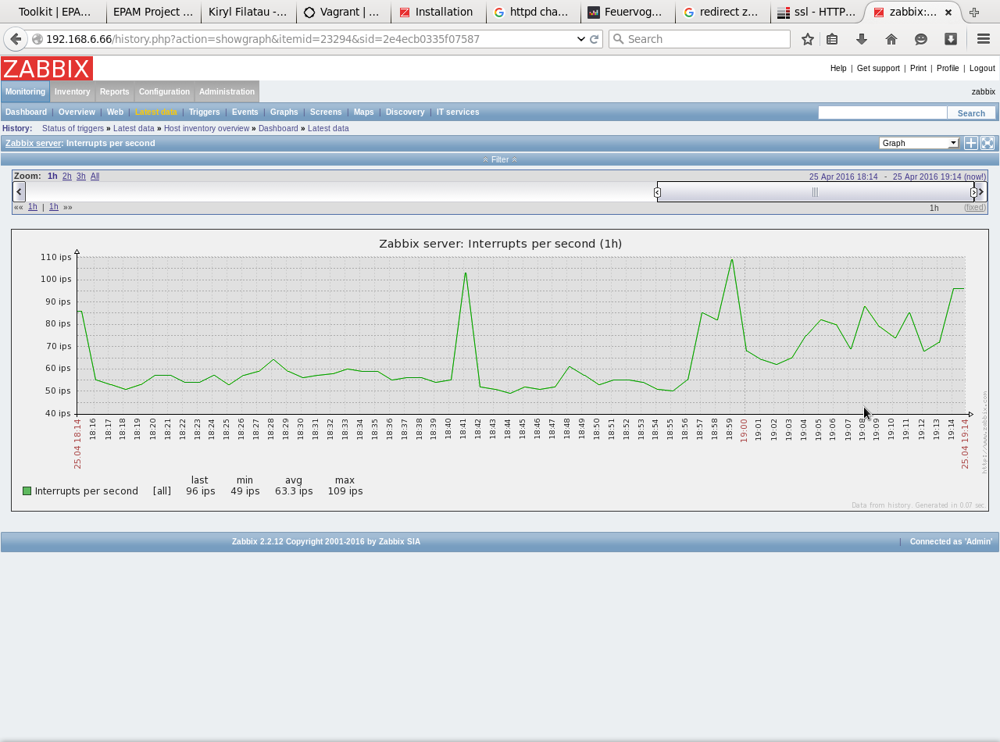
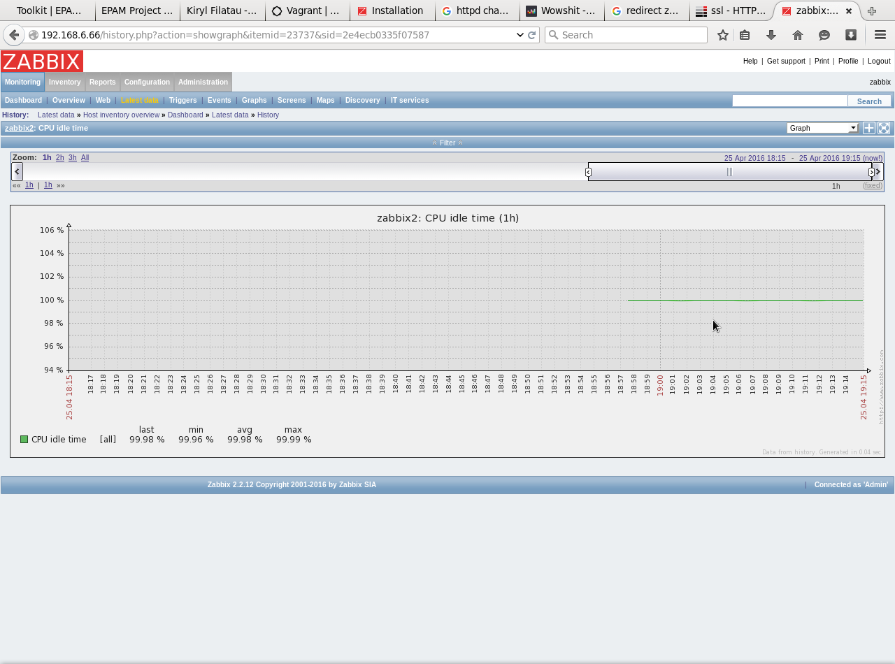
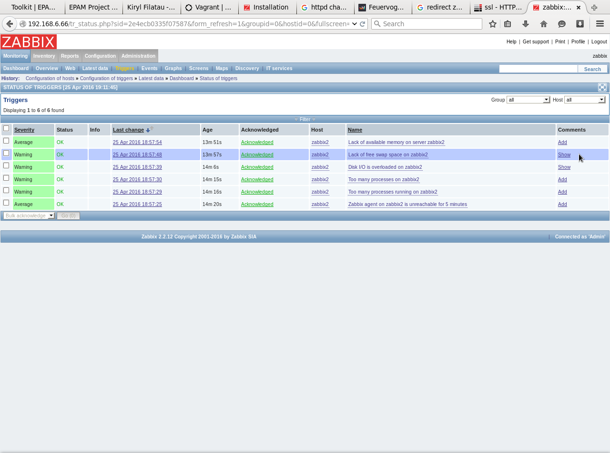
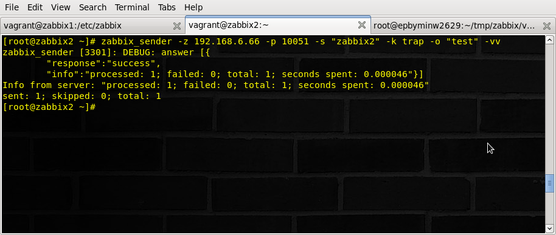
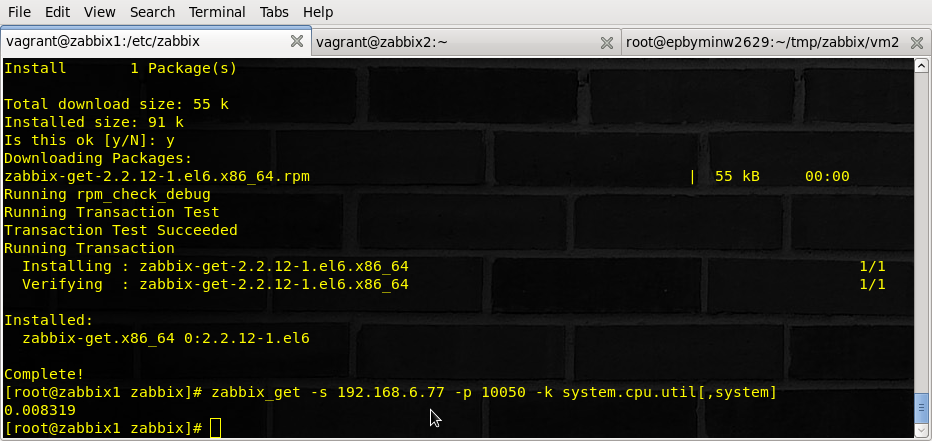

Ansible ver.: 2.1.0

Installed on CentOS with git clone git://github.com/ansible/ansible.git --recursive

Screenshot with result of execution SQL statement “select userid,alias,name,passwd,refresh from users where alias like 'Admin'; 

Screenshot with tab “Monitoring->Latest data” for host Zabbix_server (group:all).

Screenshot with tab “Configuration->Hosts” (group:all)

Screenshot with triggers list, tab “Latest data” with collected data.

Screenshot with tab “Latest data” with collected data.

Screenshot with “Monitoring->Triggers” with trigger history.

Screenshot with process of using zabbix_sender and with server reply. (Important: use zabbix_sender with key –vv for maximal verbosity)

Screenshot with process of using zabbix_get and with agent reply.

